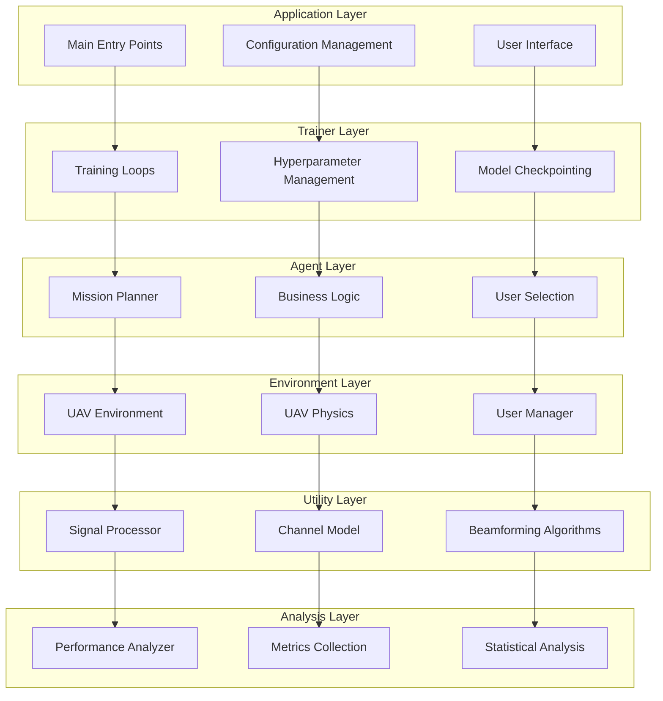

# Optimized System Architecture


# 系统架构图

## 1. 整体架构层次图

```
┌─────────────────────────────────────────────────────────────────┐
│                        APPLICATION LAYER                        │
│  ┌─────────────────┐  ┌─────────────────┐  ┌─────────────────┐  │
│  │   Main Entry    │  │ Configuration   │  │ User Interface  │  │
│  │     Points      │  │   Management    │  │   Components    │  │
│  └─────────────────┘  └─────────────────┘  └─────────────────┘  │
└─────────────────────────────────────────────────────────────────┘
                                        │
                                        ▼
┌─────────────────────────────────────────────────────────────────┐
│                         TRAINER LAYER                          │
│  ┌─────────────────┐  ┌─────────────────┐  ┌─────────────────┐  │
│  │ Training Loops  │  │ Hyperparameter  │  │ Model Checkpoint│  │
│  │ & Episodes      │  │   Management    │  │   & Logging     │  │
│  └─────────────────┘  └─────────────────┘  └─────────────────┘  │
└─────────────────────────────────────────────────────────────────┘
                                        │
                                        ▼
┌─────────────────────────────────────────────────────────────────┐
│                         AGENT LAYER                            │
│  ┌─────────────────────────────────────────────────────────────┐ │
│  │              src/strategy/mission_planner.py               │ │
│  │  • Mission Phase Management                                │ │
│  │  • Business Decision Logic                                 │ │
│  │  • Optimal User Selection                                  │ │
│  │  • Phase Transition Logic                                  │ │
│  └─────────────────────────────────────────────────────────────┘ │
└─────────────────────────────────────────────────────────────────┘
                                        │
                                        ▼
┌─────────────────────────────────────────────────────────────────┐
│                      ENVIRONMENT LAYER                         │
│  ┌─────────────────┐  ┌─────────────────┐  ┌─────────────────┐  │
│  │uav_env_simplified│  │     uav.py      │  │    users.py     │  │
│  │      .py        │  │                 │  │                 │  │
│  │ • Gym Interface │  │ • UAV Physics   │  │ • User Manager  │  │
│  │ • State Mgmt    │  │ • Movement      │  │ • Position Track│  │
│  │ • Basic Rewards │  │ • Properties    │  │ • Throughput    │  │
│  └─────────────────┘  └─────────────────┘  └─────────────────┘  │
└─────────────────────────────────────────────────────────────────┘
                                        │
                                        ▼
┌─────────────────────────────────────────────────────────────────┐
│                        UTILITY LAYER                           │
│  ┌─────────────────────────────────┐  ┌─────────────────────┐   │
│  │        src/utils/signal.py      │  │  src/utils/channel.py│   │
│  │  • Beamforming Algorithms       │  │  • Channel Modeling │   │
│  │  • Power Optimization           │  │  • Path Loss Calc   │   │
│  │  • Unified Interface            │  │  • Multi-antenna    │   │
│  │  • SINR & Throughput            │  │  • Channel Coeffs   │   │
│  └─────────────────────────────────┘  └─────────────────────┘   │
└─────────────────────────────────────────────────────────────────┘
                                        │
                                        ▼
┌─────────────────────────────────────────────────────────────────┐
│                       ANALYSIS LAYER                           │
│  ┌─────────────────────────────────────────────────────────────┐ │
│  │           src/analysis/performance_analyzer.py             │ │
│  │  • Performance Metrics Recording                           │ │
│  │  • Statistical Analysis                                    │ │
│  │  • Algorithm Comparison                                    │ │
│  │  • Visualization Data Prep                                 │ │
│  │  • Performance Trend Analysis                              │ │
│  └─────────────────────────────────────────────────────────────┘ │
└─────────────────────────────────────────────────────────────────┘
```

## 2. 数据流向图

```
┌─────────────┐    ┌─────────────┐    ┌─────────────┐    ┌─────────────┐
│ Application │───▶│   Trainer   │───▶│    Agent    │───▶│ Environment │
│   Layer     │    │   Layer     │    │   Layer     │    │   Layer     │
└─────────────┘    └─────────────┘    └─────────────┘    └─────────────┘
                                                              │
                                                              ▼
┌─────────────┐    ┌─────────────┐    ┌─────────────┐    ┌─────────────┐
│  Analysis   │◀───│ Performance │◀───│   Utility   │◀───│ Environment │
│   Layer     │    │   Metrics   │    │   Layer     │    │   Layer     │
└─────────────┘    └─────────────┘    └─────────────┘    └─────────────┘
```

## 3. 组件交互图



## 4. 文件结构图

```
src/
├── environment/
│   ├── uav_env_simplified.py     # 🔄 重构: 简化环境
│   ├── uav.py                    # 🚁 UAV物理模型
│   └── users.py                  # 👥 用户管理
├── utils/
│   ├── signal.py                 # ⚡ 增强: 统一接口
│   └── channel.py                # 📡 信道建模
├── strategy/
│   └── mission_planner.py        # 🆕 新增: 任务规划
├── analysis/
│   └── performance_analyzer.py   # 🆕 新增: 性能分析
└── [其他层...]

Notebooks/
├── uav_env_simplified_testing.ipynb  # 🆕 新增: 测试重构架构
└── [其他测试笔记本...]

docs/
├── OPTIMIZED_SYSTEM_ARCHITECTURE.md  # 📋 本文档
├── ARCHITECTURE_REFACTORING_SUMMARY.md
└── SYSTEM_ARCHITECTURE_GUIDE.md
```

## 5. 接口契约图

### Environment → Utility 接口
```
┌─────────────────────────────────────────────────────────────┐
│                Environment Layer                            │
│  ┌─────────────────────────────────────────────────────┐   │
│  │           uav_env_simplified.py                     │   │
│  │  • _calculate_throughput()                          │   │
│  │  • _calculate_reward()                              │   │
│  │  • _get_observation()                               │   │
│  └─────────────────────────────────────────────────────┘   │
└─────────────────────────────────────────────────────────────┘
                              │
                              │ 调用统一接口
                              ▼
┌─────────────────────────────────────────────────────────────┐
│                 Utility Layer                               │
│  ┌─────────────────────────────────────────────────────┐   │
│  │              signal.py                              │   │
│  │  • calculate_system_throughput()                    │   │
│  │  • get_joint_optimization_metrics()                 │   │
│  │  • beamforming algorithms                           │   │
│  └─────────────────────────────────────────────────────┘   │
└─────────────────────────────────────────────────────────────┘
```

### Agent → Environment 接口
```
┌─────────────────────────────────────────────────────────────┐
│                  Agent Layer                                │
│  ┌─────────────────────────────────────────────────────┐   │
│  │            mission_planner.py                       │   │
│  │  • select_optimal_users()                           │   │
│  │  • determine_visit_completion()                     │   │
│  │  • manage_mission_phases()                          │   │
│  └─────────────────────────────────────────────────────┘   │
└─────────────────────────────────────────────────────────────┘
                              │
                              │ 标准Gym接口
                              ▼
┌─────────────────────────────────────────────────────────────┐
│                Environment Layer                            │
│  ┌─────────────────────────────────────────────────────┐   │
│  │           uav_env_simplified.py                     │   │
│  │  • reset() → observation                            │   │
│  │  • step(action) → (obs, reward, done, info)        │   │
│  │  • render()                                         │   │
│  └─────────────────────────────────────────────────────┘   │
└─────────────────────────────────────────────────────────────┘
```

## 6. 重构前后对比图

### 重构前 (功能过载)
```
┌─────────────────────────────────────────────────────────────┐
│                    uav_env.py (500+ 行)                     │
│  ┌─────────────────────────────────────────────────────┐   │
│  │  • 环境物理模拟                                      │   │
│  │  • 复杂奖励系统                                      │   │
│  │  • 业务决策逻辑                                      │   │
│  │  • 性能分析功能                                      │   │
│  │  • 算法选择逻辑                                      │   │
│  │  • 状态管理                                          │   │
│  │  • Gym接口                                           │   │
│  └─────────────────────────────────────────────────────┘   │
└─────────────────────────────────────────────────────────────┘
```

### 重构后 (职责分离)
```
┌─────────────────────────────────────────────────────────────┐
│                Environment Layer                            │
│  ┌─────────────────────────────────────────────────────┐   │
│  │           uav_env_simplified.py                     │   │
│  │  • 环境物理模拟                                      │   │
│  │  • 基础奖励计算                                      │   │
│  │  • 状态管理                                          │   │
│  │  • Gym接口                                           │   │
│  └─────────────────────────────────────────────────────┘   │
└─────────────────────────────────────────────────────────────┘

┌─────────────────────────────────────────────────────────────┐
│                  Agent Layer                                │
│  ┌─────────────────────────────────────────────────────┐   │
│  │            mission_planner.py                       │   │
│  │  • 业务决策逻辑                                      │   │
│  │  • 任务规划                                          │   │
│  └─────────────────────────────────────────────────────┘   │
└─────────────────────────────────────────────────────────────┘

┌─────────────────────────────────────────────────────────────┐
│                Analysis Layer                               │
│  ┌─────────────────────────────────────────────────────┐   │
│  │         performance_analyzer.py                     │   │
│  │  • 性能分析功能                                      │   │
│  │  • 指标收集                                          │   │
│  └─────────────────────────────────────────────────────┘   │
└─────────────────────────────────────────────────────────────┘

┌─────────────────────────────────────────────────────────────┐
│                 Utility Layer                               │
│  ┌─────────────────────────────────────────────────────┐   │
│  │              signal.py                              │   │
│  │  • 算法选择逻辑                                      │   │
│  │  • 统一接口                                          │   │
│  └─────────────────────────────────────────────────────┘   │
└─────────────────────────────────────────────────────────────┘
```

## 7. 架构优势图

```
┌─────────────────────────────────────────────────────────────┐
│                    架构优势                                  │
├─────────────────────────────────────────────────────────────┤
│  ✅ 可维护性: 每个模块职责清晰聚焦                            │
│  ✅ 可测试性: 组件可独立测试                                  │
│  ✅ 可扩展性: 新算法/策略可独立添加                          │
│  ✅ 可重用性: 工具组件可跨环境使用                            │
│  ✅ 可扩展性: 性能分析可独立增强                              │
│  ✅ 清晰性: 环境模拟与业务逻辑明确分离                        │
└─────────────────────────────────────────────────────────────┘
```

这个架构图清晰地展示了优化后的系统结构，包括各层的职责分工、数据流向、组件交互和重构前后的对比。

## Overview
The system has been refactored from a functionally overloaded architecture to a clean, layered design that follows SOLID principles. The main improvement was decomposing the monolithic `uav_env.py` into focused, single-responsibility modules.

## Layer Structure

### 1. Application Layer
**Purpose**: High-level application coordination and user interface
**Components**:
- Main application entry points
- Configuration management
- User interface components

### 2. Trainer Layer  
**Purpose**: Reinforcement learning training orchestration
**Components**:
- Training loops and episode management
- Hyperparameter management
- Model checkpointing and logging
- Training progress monitoring

### 3. Agent Layer
**Purpose**: Decision-making and policy implementation
**Components**:
- **`src/strategy/mission_planner.py`** (NEW)
  - Mission phase management (user selection, user visiting, target rush)
  - Business decision logic (previously in environment)
  - Optimal user selection algorithms
  - Visit completion criteria determination
  - Phase transition logic

### 4. Environment Layer
**Purpose**: Physical environment simulation and RL interface
**Components**:
- **`src/environment/uav_env_simplified.py`** (REFACTORED)
  - Core environment physics simulation
  - OpenAI Gym interface (`gym.Env`)
  - UAV movement and state management
  - Basic reward calculation (throughput, progress, boundary penalties)
  - Simple termination conditions
  - Observation and action space management
- **`src/environment/uav.py`**
  - UAV physical properties and movement
  - Position and velocity management
- **`src/environment/users.py`**
  - Ground user representation
  - User position and throughput tracking
  - User manager for multiple users

### 5. Utility Layer
**Purpose**: Core algorithms and mathematical operations
**Components**:
- **`src/utils/signal.py`** (ENHANCED)
  - Beamforming algorithms (MRT, ZF, Random)
  - Power optimization strategies
  - **NEW**: Unified interface (`calculate_system_throughput`)
  - Channel coefficient calculations
  - SINR and throughput computations
- **`src/utils/channel.py`**
  - Channel modeling and path loss calculations
  - Multi-antenna channel coefficient generation

### 6. Analysis Layer (NEW)
**Purpose**: Performance analysis and metrics
**Components**:
- **`src/analysis/performance_analyzer.py`** (NEW)
  - Performance metric recording and logging
  - Statistical analysis and summaries
  - Algorithm comparison utilities
  - Visualization data preparation
  - Performance trend analysis

## Key Architectural Improvements

### Before Refactoring
- `uav_env.py` was functionally overloaded (~500+ lines)
- Mixed responsibilities: environment simulation + business logic + performance analysis
- Complex reward systems embedded in environment
- Direct algorithm selection in environment layer
- Difficult to test and maintain

### After Refactoring
- **Separation of Concerns**: Each module has a single, clear responsibility
- **Simplified Environment**: `uav_env_simplified.py` focuses purely on environment simulation
- **Business Logic Extraction**: Mission planning moved to Agent layer
- **Performance Analysis Isolation**: Dedicated analysis module
- **Unified Interface**: SignalProcessor provides clean abstraction for environment

## Data Flow

```
Application → Trainer → Agent (MissionPlanner) → Environment (UAVEnv) → Utility (SignalProcessor, ChannelModel)
                                                      ↓
                                              Analysis (PerformanceAnalyzer)
```

## Interface Contracts

### Environment → Utility Interface
```python
# Simplified, unified interface
total_throughput = signal_processor.calculate_system_throughput(
    uav_position=uav_position,
    user_positions=user_positions,
    num_antennas=num_antennas,
    total_power_constraint=power_constraint,
    channel_model=channel_model,
    beamforming_method=method,
    power_strategy=strategy
)
```

### Agent → Environment Interface
```python
# Standard OpenAI Gym interface
observation = env.reset()
observation, reward, done, info = env.step(action)
```

### Analysis → All Layers Interface
```python
# Performance metrics collection
analyzer.record_episode_metrics(episode_data)
analyzer.generate_summary()
analyzer.compare_methods(method_results)
```

## Benefits of Optimized Architecture

1. **Maintainability**: Each module has clear, focused responsibilities
2. **Testability**: Components can be tested in isolation
3. **Extensibility**: New algorithms, strategies, or analysis methods can be added without affecting other layers
4. **Reusability**: Utility components can be used across different environments
5. **Scalability**: Performance analysis can be enhanced without environment changes
6. **Clarity**: Clear separation between environment simulation and business logic

## File Structure After Refactoring

```
src/
├── environment/
│   ├── uav_env_simplified.py     # Simplified environment (was overloaded)
│   ├── uav.py                    # UAV physical model
│   └── users.py                  # User management
├── utils/
│   ├── signal.py                 # Enhanced with unified interface
│   └── channel.py                # Channel modeling
├── strategy/
│   └── mission_planner.py        # NEW: Business logic and mission planning
├── analysis/
│   └── performance_analyzer.py   # NEW: Performance analysis and metrics
└── [other layers...]

Notebooks/
├── uav_env_simplified_testing.ipynb  # NEW: Test refactored architecture
└── [other testing notebooks...]

docs/
├── OPTIMIZED_SYSTEM_ARCHITECTURE.md  # This document
├── ARCHITECTURE_REFACTORING_SUMMARY.md
└── SYSTEM_ARCHITECTURE_GUIDE.md
```

## Usage Guidelines

### For Environment Development
- Keep `uav_env_simplified.py` focused on physics and RL interface
- Use the unified SignalProcessor interface for throughput calculations
- Delegate business decisions to MissionPlanner
- Use PerformanceAnalyzer for metrics collection

### For Algorithm Development
- Add new beamforming methods to `signal.py`
- Implement new power strategies in the joint optimization framework
- Use the unified interface to maintain compatibility

### For Analysis and Evaluation
- Use `performance_analyzer.py` for all metrics collection
- Create comparison studies using the analysis module
- Generate visualizations from collected data

### For Mission Planning
- Implement new strategies in `mission_planner.py`
- Keep environment-independent business logic
- Use clear interfaces for environment interaction

This optimized architecture provides a solid foundation for future development while maintaining clean separation of concerns and following software engineering best practices.
